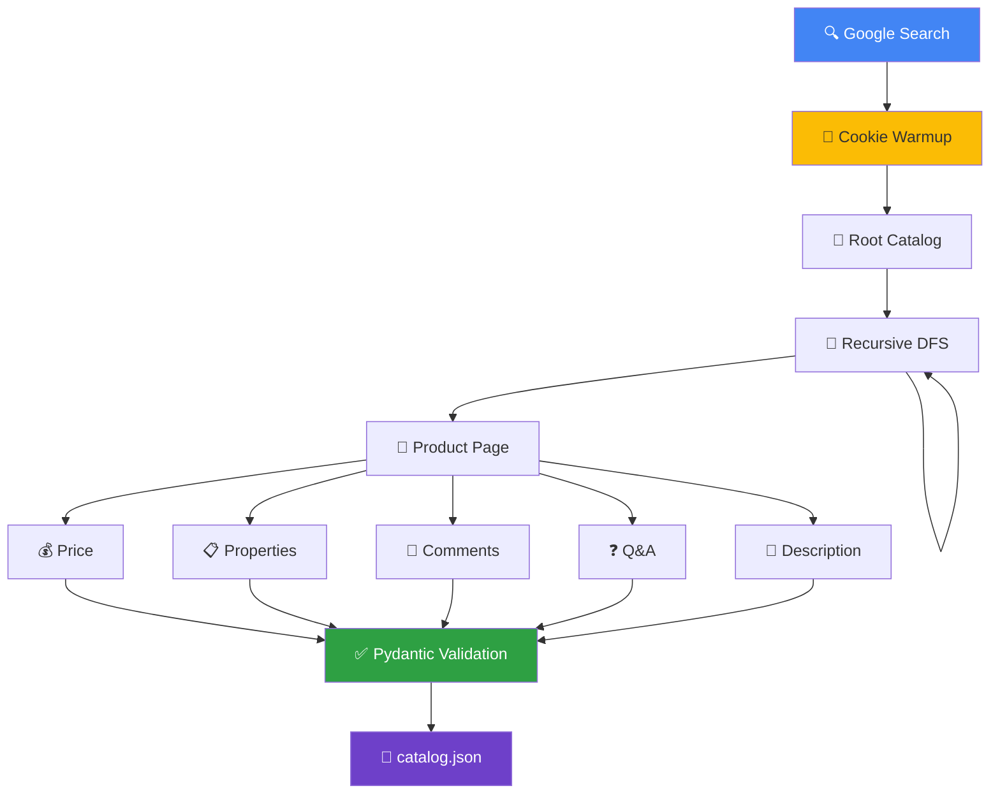

# Catalog Scraper


Веб-скрапер каталога торгового дома с антидетект-обходом, cookie warmup, lazy loading, интерактивным взаимодействием с интерфейсом через playwright и валидацией данных через Pydantic v2. На выходе - структурированный JSON-каталог товаров с характеристиками, описанием, отзывами и вопросами-ответами.

## Workflow



## Особенности

- **Антифингерпринт** - [Camoufox](https://github.com/nicegoodthings/Camoufox) на базе Firefox с `humanize=True`, рандомизированными движениями мыши, плавным скроллом с переменной скоростью и случайными задержками между запросами
- **Симуляция реферального трафика** - переход через Google Search перед целевым доменом формирует естественную картину трафика и разогревает cookie
- **Персистентные сессии** - профиль браузера и cookies сохраняются между запусками через `persistent_context`
- **Рекурсивный обход** - автоматическое обнаружение и спуск во вложенные подкатегории с поддержкой пагинации
- **Pydantic v2** - строгая типизация и валидация каждой извлечённой карточки товара
- **Идентификация товаров по URL** - исключает повторный обход уже собранных товаров
- автоматические повторные попытки при ошибках

## Быстрый старт

**1.** Скопировать `.env.example` → `.env` и указать параметры:

```bash
cp .env.example .env
```

| Переменная           | Описание                                              | По умолчанию |
|----------------------|-------------------------------------------------------|--------------|
| `MAIN_URL`           | Целевой домен каталога (**обязательная**)             | —            |
| `DEFAULT_TIMEOUT_MS` | Ожидание загрузки страницы, мс                        | `30000`      |
| `HEADLESS`           | Режим браузера: `true`/`false`, в Docker — `virtual`  | `true`       |
| `LOG_LEVEL`          | Уровень логирования                                   | `DEBUG`      |
| `RANDOM_ORDER`       | Случайный порядок обхода категорий (`true`/`false`)   | `false`      |

**2.** Запустить:

```bash
docker compose up --build
```

либо напрямую через Python:

```bash
pip install -r requirements.txt
python -m src.main
```

Результат появится в `temp/catalog.json`.

## Структура проекта

```
src/
├── main.py          # Точка входа — запуск run_with_recovery()
├── runner.py        # Инициализация Camoufox, оркестрация cookie-warmup и обхода, авто-рестарт при крахе
├── browser.py       # Google-реферал и разогрев cookie
├── crawler.py       # Рекурсивный обход каталога и пагинации списка товаров
├── product.py       # Экстракция данных товара (цена, свойства, отзывы, вопросы)
├── models.py        # Pydantic v2 модели (Product, Catalog, ProductProperty, ProductQuestion)
├── catalog.py       # JSON-persistence → temp/catalog.json
├── cache.py         # Дедупликация товаров по URL через diskcache
├── utils.py         # Retry-декоратор, имитация плавного скролла
└── logger.py        # Цветное логирование (coloredlogs)
```

## Лицензия

[GPL-3.0](LICENSE)
